# AI Agent Hub - Build Intelligent AI Agents

Uma plataforma completa para criar, gerenciar e interagir com agentes de inteligência artificial personalizados com suporte a RAG (Retrieval-Augmented Generation).

## 🎯 Para Alunos - Setup Rápido

Este repositório está preparado para você clonar e configurar rapidamente. Siga os passos abaixo para ter o sistema funcionando em poucos minutos.

## 🚀 Funcionalidades

### 🤖 Gerenciamento de Agentes IA
- **Criação de Agentes Personalizados**: Crie agentes com nomes, descrições e system prompts específicos
- **Múltiplos Modelos**: Suporte a GPT-4o, GPT-4o-mini, GPT-3.5-turbo, e modelos de reasoning O1
- **Configuração Avançada**: Controle temperatura, max tokens, e outros parâmetros
- **Status de Ativação**: Ative/desative agentes conforme necessário

### 🏢 Sistema de Workspaces
- **Organização por Workspace**: Organize agentes em diferentes espaços de trabalho
- **Gestão de Equipes**: Múltiplos usuários podem colaborar em workspaces
- **Controle de Acesso**: Sistema de proprietários e membros

### 🧠 RAG (Retrieval-Augmented Generation)
- **Base de Conhecimento**: Adicione fontes de conhecimento aos agentes
- **Múltiplos Formatos**: Suporte a URLs, PDFs, DOC/DOCX, PPTX, YouTube, texto
- **Chunking Inteligente**: Estratégias semânticas, por parágrafo, frase ou recursiva
- **Busca Híbrida**: Combinação de busca por similaridade coseno, euclidiana e híbrida
- **Configurações Personalizáveis**: Ajuste chunk size, overlap, threshold de similaridade

### 💬 Interface de Chat Avançada
- **Chat em Tempo Real**: Converse com seus agentes através de interface moderna
- **Histórico Completo**: Todas as conversas são salvas e podem ser visualizadas
- **Métricas de Performance**: Tokens usados, tempo de execução por resposta
- **Copy/Paste**: Copie respostas facilmente

### 🎨 Widget Embeddável
- **Integração Externa**: Incorpore agentes em websites externos
- **API Pública**: Endpoint público para chat sem autenticação
- **Código de Embed**: Geração automática de código HTML/JavaScript

## 📋 Pré-requisitos

- Node.js v18+ 
- npm
- Conta Cloudflare (gratuita)
- OpenAI API Key
- Pinecone API Key (opcional, para RAG)

## ⚡ Setup Rápido (5 minutos)

### 1. Clone e Instale Dependências
```bash
git clone https://github.com/cienciadosdados/aihub.git
cd aihub
npm install
```

### 2. Configurar Variáveis de Ambiente
Copie o arquivo de exemplo e configure suas API keys:
```bash
cp .env.example .env
```

Edite o arquivo `.env` com suas credenciais:
```env
# OpenAI (obrigatória)
OPENAI_API_KEY=sk-your-openai-key-here

# Pinecone (obrigatória para RAG)
PINECONE_API_KEY=your-pinecone-key-here
PINECONE_INDEX_NAME=your-index-name
PINECONE_ENVIRONMENT=your-environment

# MinerU (opcional - para PDFs avançados)
MINERU_API_KEY=your-mineru-key-here
```

### 3. Autenticação Cloudflare
```bash
npx wrangler login
```
Isso abrirá o navegador para autenticação com sua conta Cloudflare.

### 4. Configurar Features do Cloudflare

#### 4.1. Banco D1 (Database)
```bash
# Criar banco D1 (anote o database_id retornado)
npx wrangler d1 create ai-agent-hub-db
```

**IMPORTANTE**: Copie o `database_id` retornado e edite o arquivo `wrangler.jsonc`:
```json
{
  "name": "ai-agent-hub",
  "main": "src/worker/index.ts",
  "compatibility_date": "2024-11-21",
  "d1_databases": [
    {
      "binding": "DB",
      "database_name": "ai-agent-hub-db",
      "database_id": "cole-aqui-o-id-retornado"
    }
  ]
}
```

#### 4.2. Queue (Processamento RAG)
```bash
# Criar queue para processamento RAG
npx wrangler queues create rag-processing
```

#### 4.3. Executar Migrações do Banco
```bash
npm run migrate
```
Isso criará todas as tabelas: workspaces, agents, users, knowledge_sources, chunks, conversations, etc.

### 5. Configurar Secrets (API Keys)
```bash
# Script automático que lê suas keys do arquivo .env
npm run setup-secrets
```

**Ou configure manualmente:**
```bash
echo "sua-openai-key" | npx wrangler secret put OPENAI_API_KEY
echo "sua-pinecone-key" | npx wrangler secret put PINECONE_API_KEY
echo "seu-index-name" | npx wrangler secret put PINECONE_INDEX_NAME
echo "seu-environment" | npx wrangler secret put PINECONE_ENVIRONMENT
```

### 6. Executar Aplicação

**Desenvolvimento Local:**
```bash
npm run dev:all
```
- Frontend: http://localhost:5173/
- Backend: http://127.0.0.1:8787/

**Deploy para Produção:**
```bash
npm run deploy
```
- URL de Produção: `https://seu-worker-name.workers.dev`

## 📝 Scripts Disponíveis

```bash
# Desenvolvimento
npm run dev:all         # Frontend + backend juntos (recomendado)
npm run dev             # Apenas frontend (porta 5173)
npm run dev:worker      # Apenas backend/worker (porta 8787)

# Configuração
npm run migrate         # Executar migrações do banco
npm run setup-secrets   # Configurar API keys no Cloudflare

# Build e Deploy
npm run build           # Build para produção
npm run deploy          # Deploy para Cloudflare

# Utilitários
npm run type-check      # Verificar tipos TypeScript
npm run lint:fix        # Corrigir lint automaticamente
```

## 🔧 Tecnologias Utilizadas

### Frontend
- **React 19** com TypeScript
- **Vite** para build e dev server
- **Tailwind CSS** para styling
- **React Router** para navegação
- **Lucide React** para ícones

### Backend
- **Hono** - Framework web ultra-rápido para edge computing
- **Cloudflare Workers** - Serverless compute
- **Cloudflare D1** - Database SQLite distribuído
- **TypeScript** com validação Zod

### IA e RAG
- **OpenAI API** - Modelos GPT-4, GPT-3.5, O1
- **Pinecone** - Vector database para RAG
- **Semantic Chunking** - Processamento inteligente de documentos
- **Embedding** com OpenAI text-embedding-ada-002

### Processamento de Documentos
- **PDF**: pdf-parse
- **Word**: mammoth (DOCX)
- **PowerPoint**: node-pptx
- **HTML**: node-html-parser
- **YouTube**: youtube-transcript

## 🆘 Resolução de Problemas

### Erro: "no such table: workspaces"
```bash
npm run migrate
```

### Erro: "connect ECONNREFUSED 127.0.0.1:8787"
```bash
npm run dev:all
```

### Erro de API Keys
```bash
# Verificar se secrets estão configurados
npx wrangler secret list

# Reconfigurar se necessário
npm run setup-secrets
```

### Erro de Autenticação Cloudflare
```bash
npx wrangler logout
npx wrangler login
```

## 📋 Checklist Pós-Setup

- [ ] Node.js v18+ instalado
- [ ] Repositório clonado e dependências instaladas
- [ ] Arquivo `.env` configurado com API keys
- [ ] Cloudflare autenticado (`wrangler login`)
- [ ] Database D1 criado e migrações executadas
- [ ] Secrets configurados no Cloudflare
- [ ] Aplicação rodando sem erros (`npm run dev:all`)

## 🔗 Links Importantes

- [OpenAI Platform](https://platform.openai.com) - Para obter API key
- [Pinecone Console](https://app.pinecone.io) - Para RAG
- [Cloudflare Dashboard](https://dash.cloudflare.com) - Gerenciar recursos

## 🏗️ Arquitetura do Sistema

### Fluxograma Geral do AI Hub

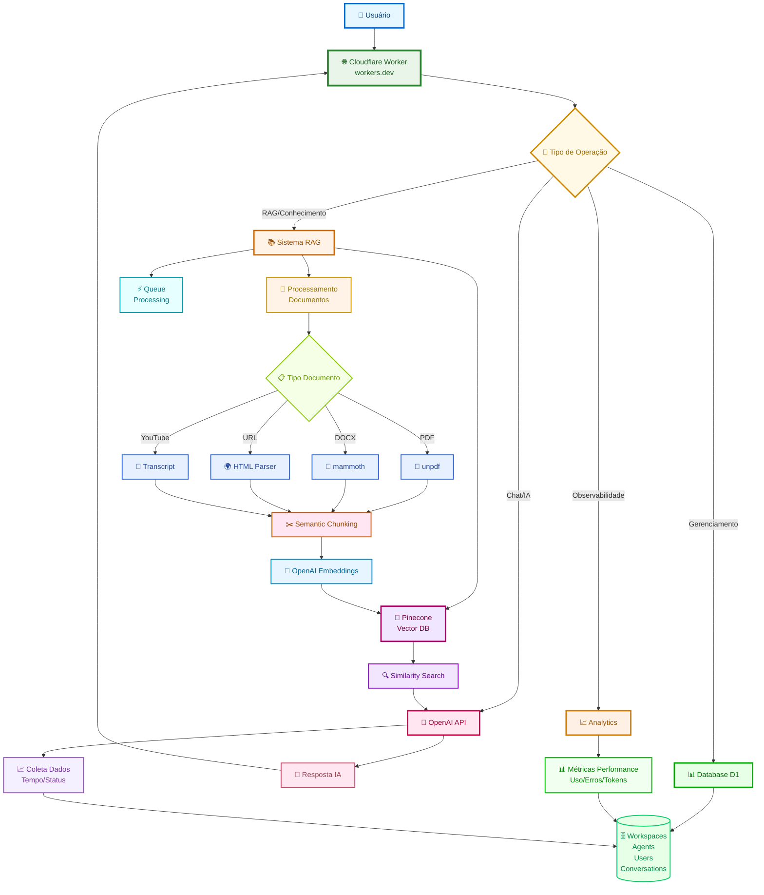

### Estrutura de Arquivos

```
├── src/
│   ├── react-app/          # Frontend React
│   │   ├── components/     # Componentes reutilizáveis
│   │   ├── pages/          # Páginas da aplicação
│   │   └── utils/          # Utilitários frontend
│   ├── worker/             # Backend Cloudflare Worker
│   │   ├── index.ts        # API routes com Hono
│   │   ├── pinecone-*.ts   # Sistema RAG
│   │   └── types.d.ts      # Tipos do worker
│   └── shared/             # Tipos compartilhados
├── migrations/             # Schema do banco
├── scripts/                # Scripts de setup/deploy
└── public/                 # Assets estáticos
```

### Stack Técnica e Integrações

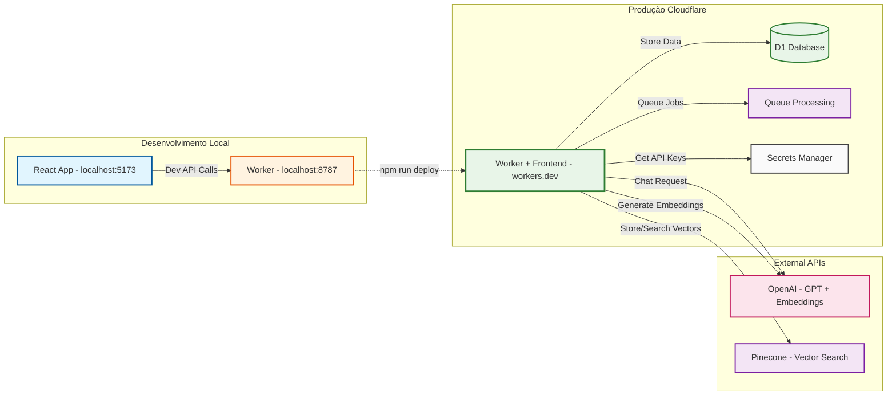

## 🚀 Deploy para Produção

### Processo de Deploy
```bash
# 1. Build da aplicação
npm run build

# 2. Deploy para Cloudflare Workers
npm run deploy
```

### Arquitetura de Produção
- **Frontend + Backend**: Servidos pelo mesmo Cloudflare Worker
- **URL única**: `https://seu-worker-name.workers.dev`
- **Edge Computing**: Distribuído globalmente pela rede Cloudflare
- **Serverless**: Zero configuração de servidor

### Detalhes das Integrações

| Ambiente | Frontend | Backend | Database |
|----------|----------|---------|----------|
| **Desenvolvimento** | localhost:5173 | localhost:8787 | D1 Local |
| **Produção** | workers.dev | workers.dev | D1 Distribuído |

| Serviço | Função | Comunicação |
|---------|--------|-------------|
| **Cloudflare Worker** | Frontend + API Backend | Serve tudo em uma URL |
| **D1 Database** | Dados estruturados | SQL queries diretas do Worker |
| **OpenAI API** | IA e Embeddings | HTTPS requests com API key |
| **Pinecone** | Vector Database | REST API para busca semântica |
| **Queue Processing** | Jobs assíncronos | Processamento RAG em background |

## API REST - Explicação para Leigos

### Fluxo Sequencial Completo

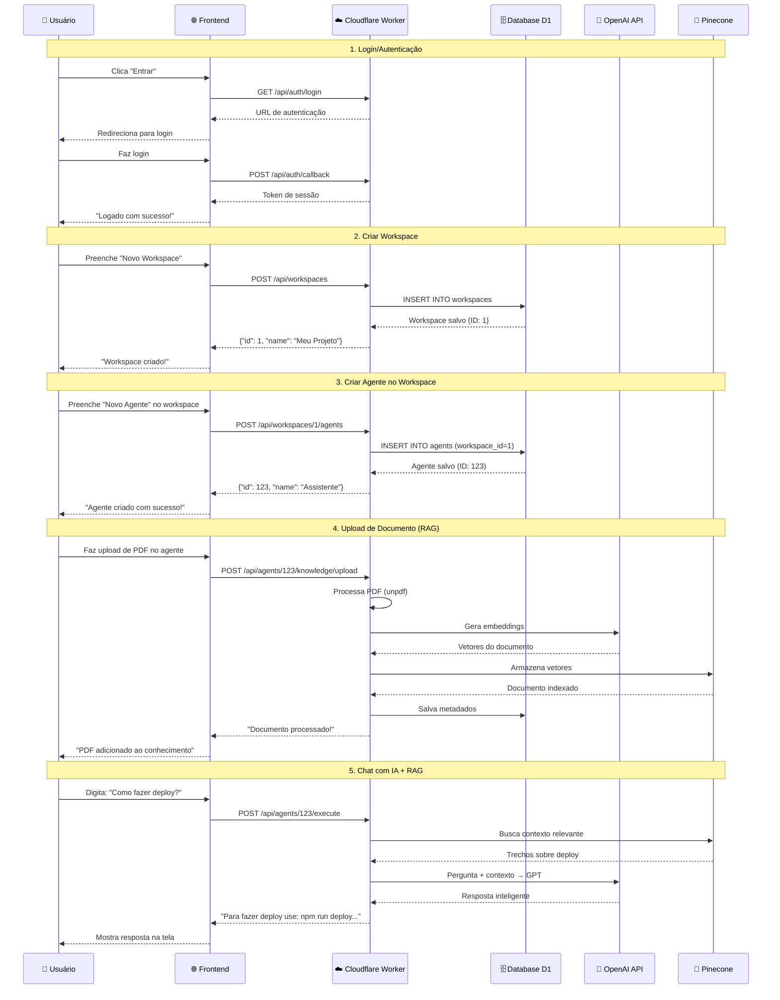

### Componentes do Sistema com Cores

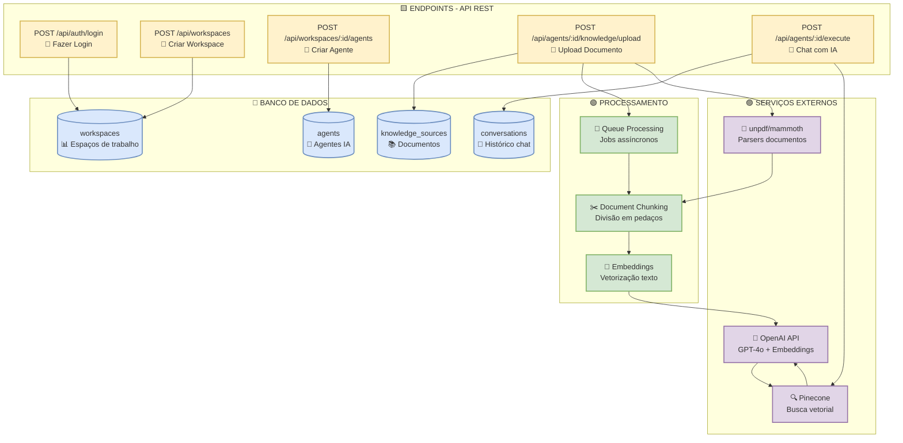

### Arquitetura Geral do Sistema

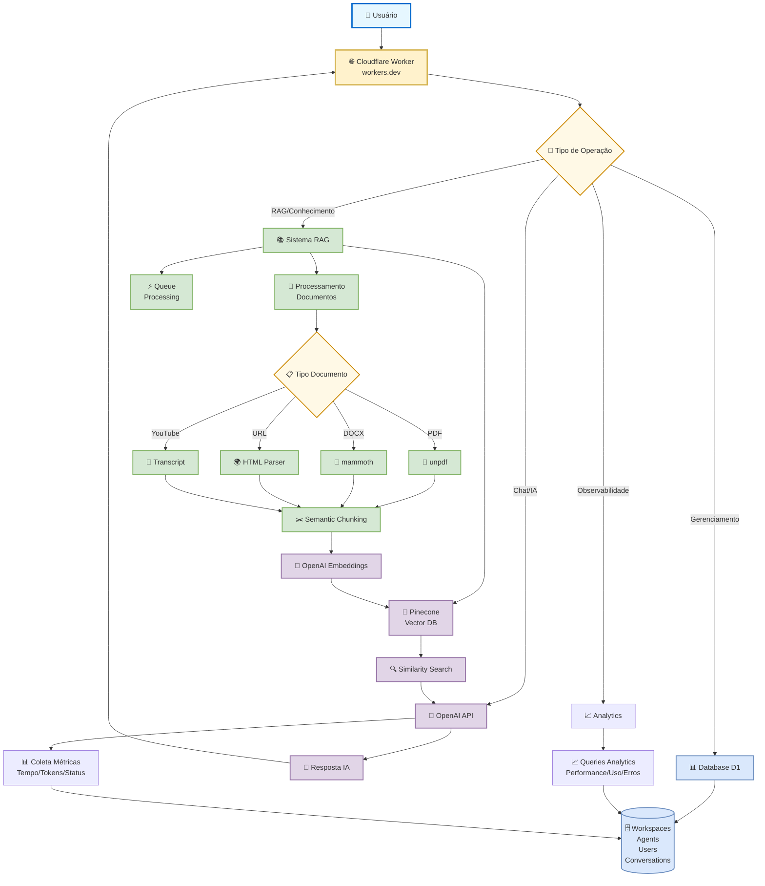

### Cloudflare Edge Computing - Computação na Borda

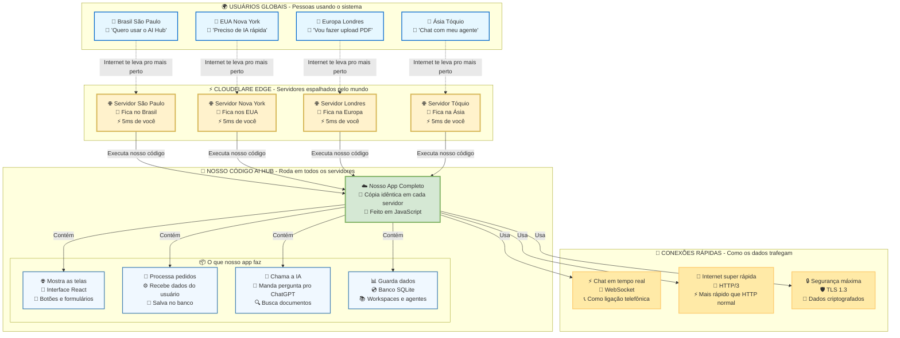

#### 🎯 **O que é Edge Computing?**

**Edge Computing** significa executar código **na borda da internet**, ou seja, o mais próximo possível dos usuários finais, em vez de em servidores centralizados distantes.

#### ⚡ **Vantagens no Nosso Sistema:**

| Aspecto | Servidor Tradicional | Cloudflare Edge |
|---------|---------------------|-----------------|
| **Latência** | 100-500ms (distante) | 5-50ms (próximo) |
| **Disponibilidade** | 1 datacenter | 300+ locais globais |
| **Escalabilidade** | Manual, limitada | Automática, ilimitada |
| **Custo** | Alto (infraestrutura) | Baixo (pay-per-use) |
| **Manutenção** | Complexa | Zero (gerenciada) |

#### 🌐 **Como Funciona no AI Hub:**

1. **Deploy Global Automático**: 
   - Código enviado para **300+ datacenters Cloudflare** (não todos ativos)
   - **Ativação sob demanda**: Só "liga" quando alguém acessa daquela região
   - Usuário sempre conecta ao **mais próximo disponível**

2. **Distribuição Inteligente**:
   - **Não são 300 cópias simultâneas** rodando o tempo todo
   - **Ativação automática**: Quando usuário do Brasil acessa, ativa servidor SP
   - **Economia de recursos**: Só usa o que precisa

3. **Processamento Distribuído**:
   - **Frontend React** servido da borda ativa
   - **API Backend** executada na borda ativa  
   - **IA Processing** chamadas diretas para OpenAI/Pinecone

4. **Database D1 Replicado**:
   - **SQLite distribuído** em múltiplas regiões ativas
   - **Consistência eventual** entre bordas
   - **Reads locais**, **writes globais**

5. **Ativação Sob Demanda**:
   - Worker **"dorme"** em bordas sem uso
   - **Desperta instantaneamente** quando necessário (~0ms)
   - **Escala automaticamente** conforme demanda

#### 🚀 **Resultado Prático:**
- **Usuário no Brasil**: Conecta à borda de São Paulo (~5ms)
- **Usuário nos EUA**: Conecta à borda de Nova York (~5ms)  
- **Mesmo código**, **mesma funcionalidade**, **performance máxima** global!

### Frontend React - Estrutura Simplificada

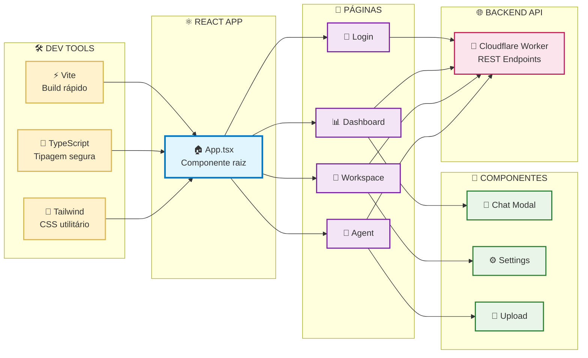

#### 🎯 **Tecnologias Frontend:**

| Ferramenta | Função | Por que usamos |
|------------|--------|----------------|
| **Vite** | Build tool | ⚡ 10x mais rápido que Webpack |
| **React 19** | UI Framework | ⚛️ Componentes reutilizáveis |
| **TypeScript** | Linguagem | 🔒 Tipagem previne bugs |
| **Tailwind CSS** | Estilização | 🎨 Classes utilitárias rápidas |

#### 📱 **Estrutura de Páginas:**

- **Login/SignUp**: Autenticação com Mocha Users Service
- **Dashboard**: Lista workspaces do usuário
- **Workspace**: Gerencia agentes e configurações
- **Agent**: Interface de chat e configuração IA
- **Home**: Landing page e navegação

#### 🔄 **Fluxo de Desenvolvimento:**

1. **`npm run dev`** → Vite inicia servidor local (localhost:5173)
2. **Hot reload** → Mudanças aparecem instantaneamente
3. **TypeScript** → Verifica tipos em tempo real
4. **Tailwind** → Classes CSS aplicadas automaticamente
5. **Build** → `npm run build` gera arquivos otimizados

### Backend Cloudflare Worker - Estrutura Simplificada

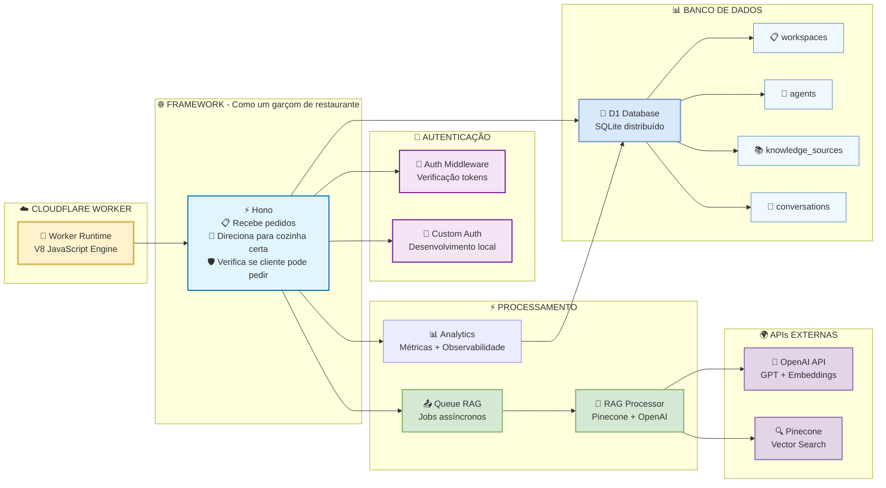

#### 🎯 **Tecnologias Backend Explicadas:**

| Ferramenta | O que é (para leigos) | Analogia |
|------------|----------------------|----------|
| **Cloudflare Worker** | 🏠 Casa onde o código mora | Como ter uma casa em 300 cidades |
| **Hono Framework** | 👨‍🍳 Garçom do restaurante | Recebe pedidos e leva pra cozinha certa |
| **D1 Database** | 📚 Arquivo gigante | Como uma gaveta de arquivos mágica |
| **Queue** | 📮 Caixa de correio | Tarefas pesadas ficam na fila |

#### 🔍 **Explicação Detalhada:**

**🌐 Web Framework (Hono):**
- **O que é**: Como um **garçom de restaurante**
- **Roteamento**: Quando você pede "pizza", ele sabe levar pra **cozinha italiana**
- **Middleware**: Antes de servir, ele **verifica se você pagou**
- **No nosso caso**: 
  - Pedido `/api/login` → Vai pra "cozinha" de autenticação
  - Pedido `/api/chat` → Vai pra "cozinha" de IA
  - Sempre verifica se você está logado antes

**🚪 Roteamento:**
- **Analogia**: Como **placas de trânsito** na internet
- **`/api/workspaces`** → Placa que diz "vá para seção workspaces"
- **`/api/agents/123/chat`** → Placa que diz "vá para agente 123, seção chat"
- **Nosso sistema**: Tem 20+ "placas" diferentes

**🛡️ Middleware:**
- **Analogia**: Como **segurança do shopping**
- **Antes de entrar**: Verifica se você tem pulseirinha (token)
- **Se não tem**: "Desculpe, precisa fazer login primeiro"
- **Se tem**: "Pode passar, bem-vindo!"
- **Nosso sistema**: Toda rota protegida passa pelo "segurança"

#### 📋 **Estrutura de Endpoints:**

- **Auth**: `/api/auth/*` - Login, signup, callback
- **Workspaces**: `/api/workspaces` - CRUD espaços de trabalho
- **Agents**: `/api/workspaces/:id/agents` - CRUD agentes IA
- **Knowledge**: `/api/agents/:id/knowledge/*` - Upload e RAG
- **Chat**: `/api/agents/:id/execute` - Conversas com IA

#### 🔄 **Fluxo de Processamento:**

1. **Request** → Worker recebe via Hono
2. **Auth** → Middleware verifica permissões
3. **Database** → Consulta/salva no D1
4. **Queue** → Envia jobs RAG assíncronos
5. **AI** → Chama OpenAI/Pinecone conforme necessário
6. **Response** → Retorna JSON para frontend

### Sistema de IA - RAG e Processamento Inteligente

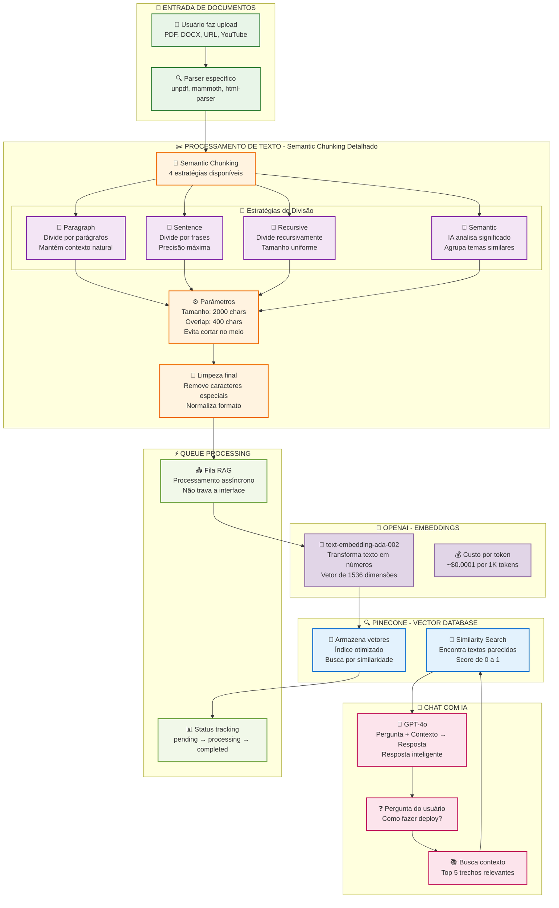

#### 🤖 **Tecnologias de IA Explicadas:**

| Ferramenta | O que faz (para leigos) | Analogia |
|------------|-------------------------|----------|
| **OpenAI Embeddings** | 🔢 Transforma texto em números | Como DNA do texto |
| **Pinecone** | 🔍 Encontra textos parecidos | Como Google para documentos |
| **GPT-4o** | 🧠 Responde perguntas inteligentes | Como professor que leu tudo |
| **RAG** | 📚 Busca + IA = Resposta precisa | Professor + biblioteca |

#### ✂️ **Semantic Chunking Detalhado:**

**🎯 4 Estratégias Disponíveis:**

1. **📄 Paragraph Strategy**:
   - **Como funciona**: Divide texto por parágrafos naturais
   - **Vantagem**: Mantém contexto e fluxo de ideias
   - **Exemplo**: Um parágrafo sobre "instalação" fica junto

2. **📝 Sentence Strategy**:
   - **Como funciona**: Divide por frases completas
   - **Vantagem**: Precisão máxima, sem cortar no meio
   - **Exemplo**: "Para instalar, execute npm install." = 1 chunk

3. **🔄 Recursive Strategy**:
   - **Como funciona**: Divide recursivamente até tamanho ideal
   - **Vantagem**: Chunks de tamanho uniforme
   - **Exemplo**: Se muito grande, divide pela metade novamente

4. **🧠 Semantic Strategy** (Padrão):
   - **Como funciona**: IA analisa significado e agrupa temas
   - **Vantagem**: Chunks semanticamente coerentes
   - **Exemplo**: Tudo sobre "deploy" fica no mesmo chunk

**⚙️ Parâmetros Configuráveis:**
- **Tamanho**: 2000 caracteres (otimizado para embeddings)
- **Overlap**: 400 caracteres (evita perder contexto entre chunks)
- **Fallback**: Se semantic falha, usa recursive automaticamente

#### 🔄 **Fluxo RAG Simplificado:**

1. **📄 Upload**: Usuário envia PDF
2. **✂️ Chunking**: Aplica estratégia semântica inteligente
3. **🔢 Embeddings**: OpenAI transforma em números
4. **💾 Storage**: Pinecone guarda os números
5. **❓ Pergunta**: Usuário faz pergunta
6. **🔍 Busca**: Pinecone encontra trechos relevantes
7. **🤖 Resposta**: GPT responde usando contexto encontrado

### Schema do Banco D1 - Estrutura Completa

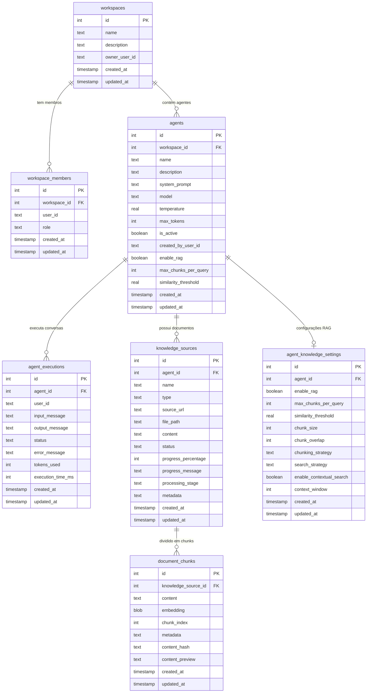

#### 📊 **Estrutura do Banco Explicada:**

**🏢 Hierarquia Principal:**
- **Workspaces** → **Agents** → **Knowledge Sources** → **Document Chunks**
- **Usuários** podem ser **membros** de múltiplos workspaces
- **Agents** pertencem a um workspace específico

**📋 Tabelas Principais:**

| Tabela | Função | Campos Importantes |
|--------|--------|-------------------|
| **workspaces** | 🏢 Espaços de trabalho | `owner_user_id`, `name` |
| **agents** | 🤖 Agentes IA | `workspace_id`, `enable_rag`, `model` |
| **knowledge_sources** | 📚 Documentos | `agent_id`, `type`, `content`, `status` |
| **document_chunks** | ✂️ Pedaços de texto | `knowledge_source_id`, `content`, `embedding` |
| **agent_executions** | 💬 Histórico chat | `agent_id`, `input_message`, `tokens_used` |

**⚙️ Configurações RAG:**
- **agents**: Configurações básicas (enable_rag, similarity_threshold)
- **agent_knowledge_settings**: Configurações avançadas (chunk_size, strategy)

**🔍 Índices para Performance:**
- **Busca por workspace**: `idx_agents_workspace`
- **Busca por status**: `idx_knowledge_sources_status`
- **Busca por hash**: `idx_document_chunks_hash`

### Configurações e Settings do Sistema

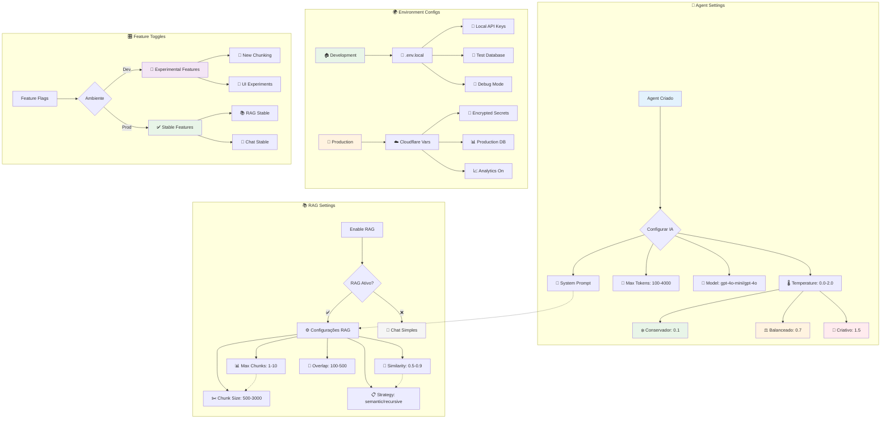

#### ⚙️ **Configurações Detalhadas:**

**🤖 Agent Settings:**

| Parâmetro | Valores | Impacto |
|-----------|---------|---------|
| **Temperature** | 0.1 (conservador) → 1.5 (criativo) | Criatividade das respostas |
| **Max Tokens** | 100-4000 | Tamanho máximo da resposta |
| **Model** | gpt-4o-mini, gpt-4o | Qualidade vs custo |
| **System Prompt** | Texto livre | Personalidade do agente |

**📚 RAG Settings:**

| Configuração | Padrão | Descrição |
|--------------|--------|-----------|
| **Max Chunks** | 3 | Quantos trechos usar no contexto |
| **Similarity** | 0.7 | Quão similar deve ser (0.5-0.9) |
| **Chunk Size** | 2000 | Tamanho dos pedaços de texto |
| **Overlap** | 400 | Sobreposição entre chunks |
| **Strategy** | semantic | Como dividir o texto |

**🌍 Environment Configs:**

**Development (.env.local):**
```bash
OPENAI_API_KEY=sk-local...
PINECONE_API_KEY=local-key
DATABASE_URL=local.db
DEBUG_MODE=true
```

**Production (Cloudflare):**
```bash
# Encrypted secrets via wrangler
OPENAI_API_KEY=encrypted
PINECONE_API_KEY=encrypted  
DATABASE_URL=production.db
ANALYTICS_ENABLED=true
```

### Deploy Pipeline - Cloudflare Workers

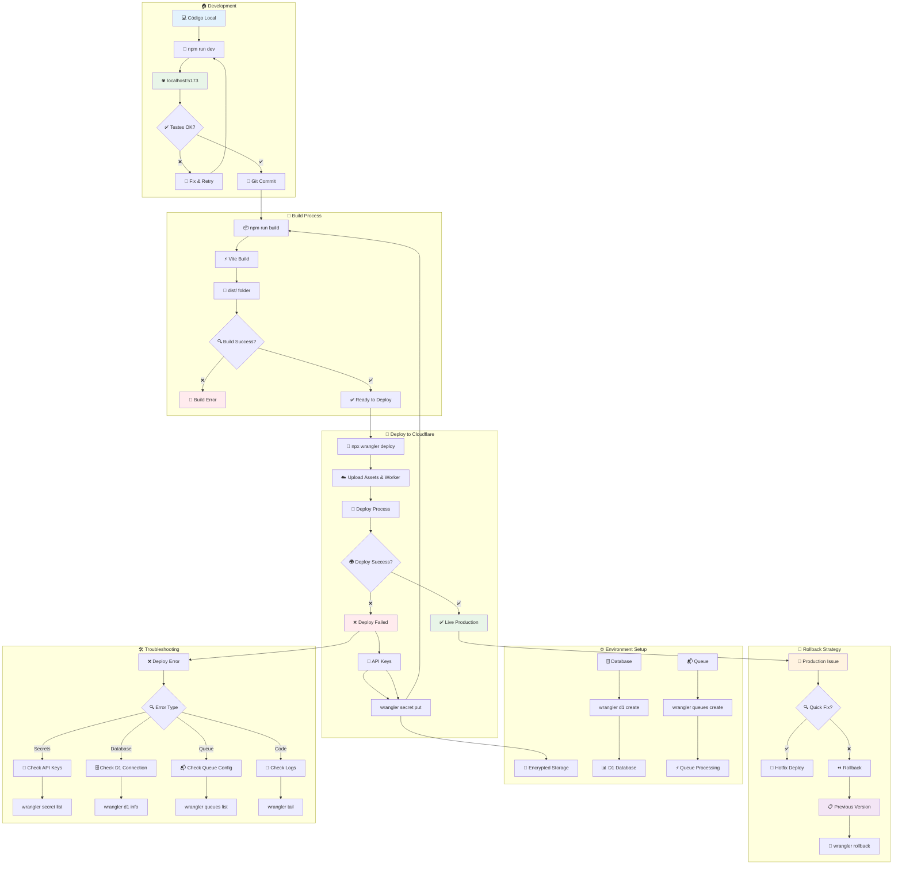

#### 🚀 **Comandos Wrangler Essenciais:**

**📦 Deploy Commands:**
```bash
# Deploy principal
wrangler deploy

# Deploy com nome específico
wrangler deploy --name ai-hub-prod

# Deploy para ambiente específico
wrangler deploy --env production
```

**🔑 Secrets Management:**
```bash
# Adicionar secret
wrangler secret put OPENAI_API_KEY

# Listar secrets
wrangler secret list

# Deletar secret
wrangler secret delete OLD_KEY
```

**🗄️ Database Commands:**
```bash
# Criar database
wrangler d1 create ai-hub-db

# Executar migrations
wrangler d1 migrations apply ai-hub-db

# Query database
wrangler d1 execute ai-hub-db --command "SELECT * FROM users LIMIT 5"
```

**📬 Queue Commands:**
```bash
# Criar queue
wrangler queues create rag-processing

# Listar queues
wrangler queues list

# Monitorar queue
wrangler queues consumer add rag-processing
```

**🔍 Monitoring & Debug:**
```bash
# Ver logs em tempo real
wrangler tail

# Ver logs específicos
wrangler tail --format pretty

# Informações do worker
wrangler whoami
```

## 🚨 Troubleshooting Deploy

### Problema: Analytics/Settings não aparecem em produção

**Sintomas:**
- Funciona no desenvolvimento local (`npm run dev`)
- Não aparece após deploy no Cloudflare
- Build executa sem erros

**Soluções:**

1. **Limpar cache de build:**
```bash
# Windows
Remove-Item -Recurse -Force dist
npm run build
npx wrangler deploy

# Linux/Mac
rm -rf dist
npm run build
npx wrangler deploy
```

2. **Verificar erros TypeScript:**
```bash
# Corrigir imports não utilizados
# Remover referências a arquivos inexistentes no tsconfig
```

3. **Forçar visibilidade com style inline:**
```tsx
<button 
  style={{ display: 'flex' }}
  className="..."
>
  Analytics
</button>
```

4. **Verificar sincronização código:**
```bash
git status
git diff HEAD
# Commit mudanças se necessário
```

### Comandos Corretos

❌ **Incorreto:**
```bash
wrangler deploy --force  # Argumento não existe
wrangler auth login      # Comando não reconhecido
```

✅ **Correto:**
```bash
npx wrangler deploy      # Deploy padrão
npx wrangler auth login  # Login (se necessário)
```

## 📁 Estrutura do Projeto

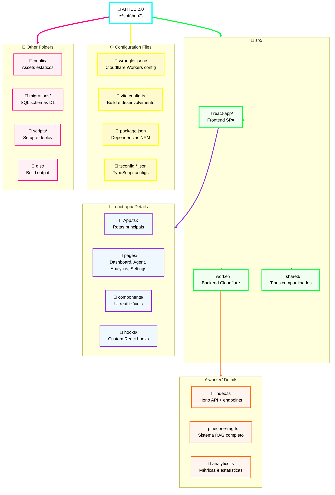

### 📋 Descrição dos Arquivos Principais

| Arquivo | Função | Tecnologia |
|---------|--------|------------|
| `src/react-app/App.tsx` | Rotas e autenticação | React Router |
| `src/worker/index.ts` | API backend principal | Hono + Cloudflare Workers |
| `src/worker/pinecone-rag.ts` | Sistema RAG completo | Pinecone + OpenAI |
| `src/react-app/pages/Agent.tsx` | Interface de chat IA | React + WebSocket |
| `src/react-app/pages/Analytics.tsx` | Dashboard de métricas | React + Charts |
| `wrangler.jsonc` | Configuração Cloudflare | Workers, D1, R2, Queues |
| `vite.config.ts` | Build e desenvolvimento | Vite + React |
| `migrations/*.sql` | Schema do banco | D1 Database |

### Segurança e Isolamento de Dados

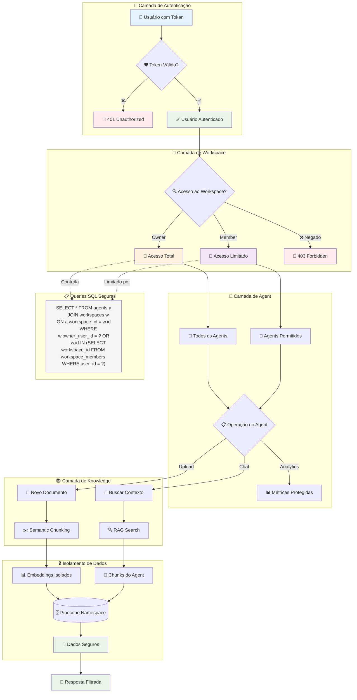

#### 🔒 **Medidas de Segurança Implementadas:**

**🛡️ Autenticação Obrigatória:**
- **Middleware** valida token em todas as rotas protegidas
- **Bearer Token** verificado em cada request
- **401 Unauthorized** se token inválido ou ausente

**🏢 Autorização por Workspace:**
- **Owner**: Criador do workspace (acesso total)
- **Member**: Usuário adicionado como membro
- **Isolamento**: Cada usuário só vê seus workspaces

**📊 Controle de Acesso SQL:**
```sql
-- Exemplo: Buscar agentes com segurança
SELECT a.* FROM agents a
JOIN workspaces w ON a.workspace_id = w.id
LEFT JOIN workspace_members wm ON w.id = wm.workspace_id
WHERE a.id = ? AND (w.owner_user_id = ? OR wm.user_id = ?)
```

**🎯 Isolamento de Dados:**

| Nível | Proteção | Como Funciona |
|-------|----------|---------------|
| **👤 User** | Token Auth | Middleware valida identidade |
| **🏢 Workspace** | Owner/Member | SQL filtra por user_id |
| **🤖 Agent** | Via Workspace | JOIN com workspace autorizado |
| **📚 Knowledge** | Via Agent | JOIN com agent autorizado |
| **✂️ Chunks** | Via Knowledge | Embeddings isolados por fonte |

**🚨 Pontos Críticos:**
- **Desenvolvimento**: Auth simplificado (customAuthMiddleware)
- **Produção**: Mocha Users Service (mais seguro)
- **Pinecone**: Namespace por agente para isolamento
- **Queue**: Jobs processados com contexto do usuário

**🔍 Índices para Performance:**
- **Busca por workspace**: `idx_agents_workspace`
- **Busca por status**: `idx_knowledge_sources_status`
- **Busca por hash**: `idx_document_chunks_hash`

### Principais Endpoints da API

| Método | Endpoint | O que faz | Exemplo |
|--------|----------|-----------|---------|
| **POST** | `/api/auth/login` | Fazer login | `{"email": "user@email.com", "password": "123"}` |
| **GET** | `/api/workspaces` | Listar workspaces | Retorna lista de espaços de trabalho |
| **POST** | `/api/workspaces` | Criar workspace | `{"name": "Meu Projeto"}` |
| **GET** | `/api/workspaces/:id/agents` | Listar agentes do workspace | Retorna lista de agentes |
| **POST** | `/api/workspaces/:id/agents` | Criar agente no workspace | `{"name": "Assistente", "prompt": "Você é..."}` |
| **GET** | `/api/agents/:id` | Buscar agente específico | Retorna dados do agente ID 123 |
| **POST** | `/api/agents/:id/knowledge/upload` | Upload documento no agente | Envia PDF/DOCX para processamento |
| **POST** | `/api/agents/:id/execute` | Chat com IA + RAG | `{"message": "Olá!", "conversation_id": "conv_456"}` |
| **GET** | `/api/conversations` | Histórico de chats | Lista conversas anteriores |

### Como Funciona uma Requisição REST

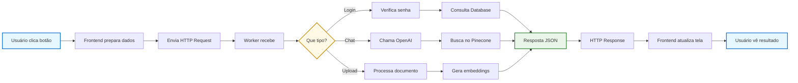

### Exemplo Prático: Chat com IA

**1. Usuário digita pergunta:**
```
"Como configurar o banco de dados?"
```

**2. Frontend envia requisição:**
```http
POST /api/agents/123/execute
Content-Type: application/json

{
  "message": "Como configurar o banco de dados?",
  "conversation_id": "conv_456"
}
```

**3. Worker processa:**
- Verifica acesso ao workspace
- Busca contexto no Pinecone
- Envia para OpenAI com contexto
- Retorna resposta inteligente

**4. Resposta JSON:**
```json
{
  "response": "Para configurar o banco D1, execute: npx wrangler d1 create...",
  "tokens_used": 150,
  "response_time": "1.2s"
}
```

**5. Frontend mostra resposta na tela**