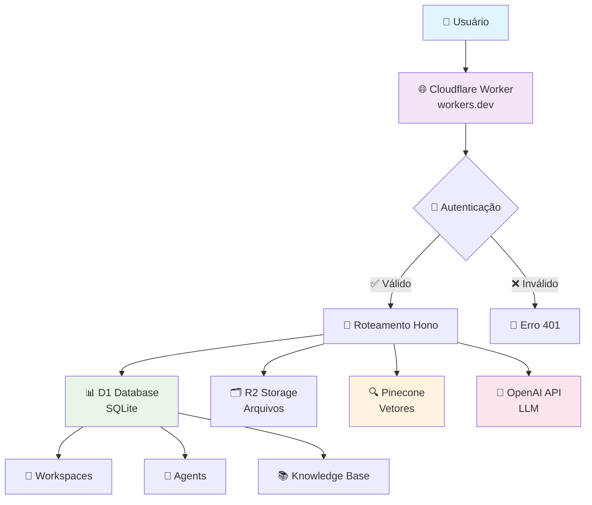
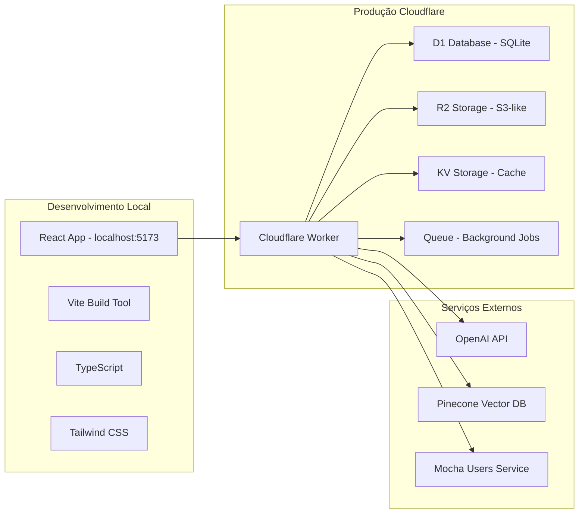
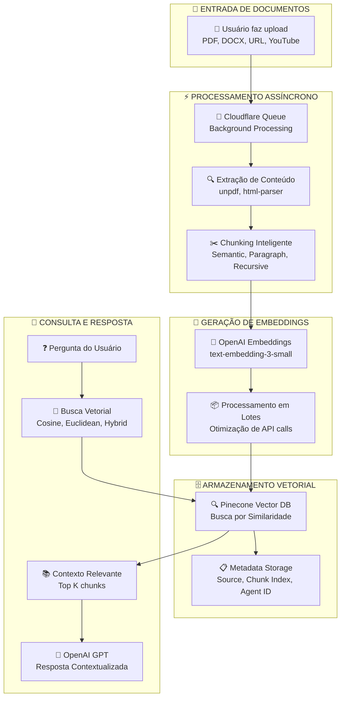
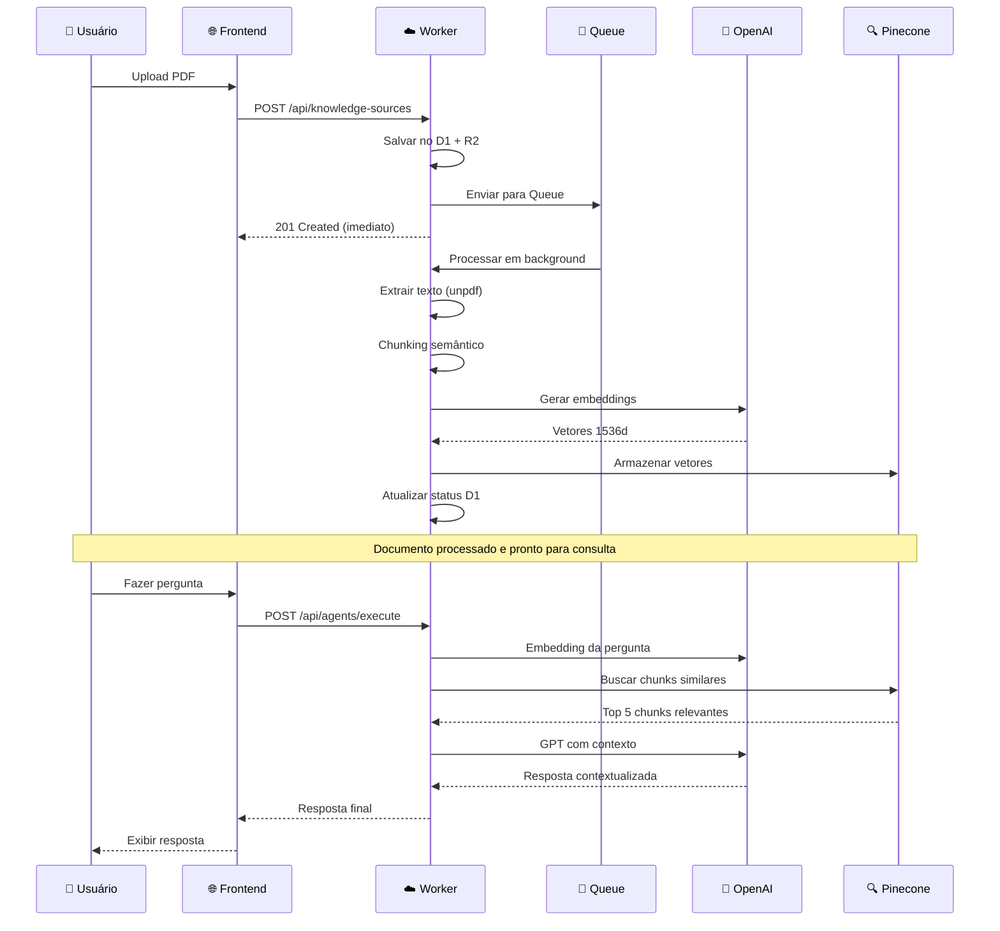

# 🎯 AI Agent Hub - Estratégia de Apresentação AI CODE PRO

## 📋 Roteiro Detalhado (90 minutos)

### 🚀 **1. Abertura: "O Problema Real"** (10min)
**Hook:** "Quantos já tentaram integrar IA em produção e se frustraram?"

**Problemas comuns:**
- IA genérica demais para casos específicos
- Dificuldade de adicionar conhecimento próprio
- Complexidade de deployment e escala
- Falta de controle sobre respostas

**Nossa solução:** Plataforma completa de AI Agents com RAG

---

### 🏗️ **2. Arquitetura & Stack Técnica** (20min)

#### **Diagrama 1: Visão Geral do Sistema**


**Código Live - Setup Básico:**
```typescript
// src/worker/index.ts
import { Hono } from 'hono';
import { cors } from 'hono/cors';

interface Env {
  DB: any; // D1Database
  R2: any; // R2Bucket
  OPENAI_API_KEY: string;
  PINECONE_API_KEY: string;
  RAG_QUEUE: Queue<QueueMessage>;
}

const app = new Hono<{ Bindings: Env }>();

app.use("*", cors({
  origin: "*",
  allowMethods: ["GET", "POST", "PUT", "DELETE", "OPTIONS"],
  allowHeaders: ["Content-Type", "Authorization"],
  credentials: true,
}));
```

#### **Diagrama 2: Stack Técnica**


**Por que Cloudflare Workers?**
- **Edge Computing:** Latência ultra baixa globalmente
- **Serverless:** Zero configuração de servidor
- **Escala automática:** De 0 a milhões de requests
- **Custo:** Muito mais barato que AWS/Azure

---

### 🧠 **3. RAG Pipeline - O Coração do Sistema** (25min)

#### **Diagrama 3: Sistema RAG Completo**


**Código Live - Processamento RAG:**
```typescript
// src/worker/pinecone-rag.ts
export class PineconeRAGProcessor {
  
  async chunkText(
    text: string, 
    chunkSize: number = 2000, 
    overlap: number = 400, 
    strategy: 'paragraph' | 'sentence' | 'recursive' | 'semantic' = 'semantic'
  ): Promise<DocumentChunk[]> {
    
    // Chunking semântico usando OpenAI
    const semanticChunks = await this.semanticChunker.chunkTextSemantically(
      text, 
      chunkSize, 
      overlap
    );
    
    return semanticChunks.map((chunk, index) => ({
      content: chunk.content,
      metadata: {
        chunk_index: index,
        chunk_size: chunk.content.length,
        strategy: 'semantic'
      },
      chunk_index: index
    }));
  }

  async searchSimilarChunks(
    query: string,
    agentId: number,
    topK: number = 5,
    threshold: number = 0.7,
    strategy: 'cosine' | 'euclidean' | 'hybrid' = 'hybrid'
  ): Promise<DocumentChunk[]> {
    
    // Gerar embedding da query
    const queryEmbedding = await this.generateEmbedding(query);
    
    // Buscar no Pinecone
    const results = await this.vectorStore.query({
      vector: queryEmbedding,
      topK,
      filter: { agent_id: agentId },
      includeMetadata: true
    });
    
    // Filtrar por threshold
    return results.matches
      .filter(match => match.score >= threshold)
      .map(match => ({
        content: match.metadata.content,
        metadata: match.metadata,
        chunk_index: match.metadata.chunk_index
      }));
  }
}
```

#### **Diagrama 4: Fluxo de Processamento**


---

### 💻 **4. Demo LIVE - Criando um Agente** (20min)

**Roteiro da Demo:**

1. **Criar Workspace**
   - Mostrar interface React
   - Explicar conceito de multi-tenancy

2. **Criar Agente IA**
   - System prompt personalizado
   - Configurar modelo (GPT-4o)
   - Ajustar parâmetros (temperature, max_tokens)

3. **Adicionar Conhecimento**
   - Upload de PDF técnico
   - Mostrar processamento em background
   - Explicar chunking strategy

4. **Chat em Tempo Real**
   - Fazer perguntas específicas do documento
   - Mostrar como o RAG funciona
   - Métricas de performance

5. **Widget Embed**
   - Gerar código de incorporação
   - Testar em página externa

**Código da Demo - Endpoint de Chat:**
```typescript
// Endpoint principal de chat
app.post('/api/agents/:agentId/execute', 
  zValidator('json', ExecuteAgentSchema),
  async (c) => {
    const { agentId } = c.req.param();
    const { message } = c.req.valid('json');
    
    // Buscar agente
    const agent = await c.env.DB.prepare(`
      SELECT * FROM agents WHERE id = ? AND active = 1
    `).bind(agentId).first();
    
    // RAG Search se habilitado
    let contextMessage = message;
    if (agent.enable_rag) {
      const ragProcessor = new PineconeRAGProcessor(
        c.env.OPENAI_API_KEY,
        c.env.PINECONE_API_KEY
      );
      
      const relevantChunks = await ragProcessor.searchSimilarChunks(
        message,
        parseInt(agentId),
        agent.max_chunks_per_query,
        agent.similarity_threshold,
        agent.search_strategy
      );
      
      if (relevantChunks.length > 0) {
        const context = relevantChunks.map(chunk => chunk.content).join('\n\n');
        contextMessage = `Context: ${context}\n\nQuestion: ${message}`;
      }
    }
    
    // Chamar OpenAI
    const openai = new OpenAI({ apiKey: c.env.OPENAI_API_KEY });
    const completion = await openai.chat.completions.create({
      model: agent.model,
      messages: [
        { role: "system", content: agent.system_prompt },
        { role: "user", content: contextMessage }
      ],
      temperature: agent.temperature,
      max_tokens: agent.max_tokens,
    });
    
    return c.json({
      response: completion.choices[0].message.content,
      tokens_used: completion.usage.total_tokens
    });
  }
);
```

---

### 🔧 **5. Implementação Técnica Avançada** (10min)

**Queue Processing para RAG Assíncrono:**
```typescript
// Queue Consumer
export default {
  async queue(batch: MessageBatch<QueueMessage>, env: Env): Promise<void> {
    for (const message of batch.messages) {
      try {
        const { sourceId, agentId, data } = message.body;
        
        const ragProcessor = new PineconeRAGProcessor(
          env.OPENAI_API_KEY,
          env.PINECONE_API_KEY
        );
        
        await ragProcessor.processKnowledgeSource(
          sourceId,
          agentId,
          data,
          {
            chunk_size: 2000,
            chunk_overlap: 400,
            chunking_strategy: 'semantic'
          }
        );
        
        // Atualizar status no banco
        await env.DB.prepare(`
          UPDATE knowledge_sources 
          SET status = 'completed', processed_at = datetime('now')
          WHERE id = ?
        `).bind(sourceId).run();
        
        message.ack();
      } catch (error) {
        console.error('Queue processing error:', error);
        message.retry();
      }
    }
  }
};
```

**Semantic Chunking Avançado:**
```typescript
// src/worker/semantic-chunker.ts
export class SemanticChunker {
  
  async chunkTextSemantically(
    text: string,
    targetChunkSize: number = 2000,
    overlap: number = 400
  ): Promise<SemanticChunk[]> {
    
    // 1. Dividir em sentenças
    const sentences = this.splitIntoSentences(text);
    
    // 2. Gerar embeddings para cada sentença
    const sentenceEmbeddings = await this.batchGenerateEmbeddings(sentences);
    
    // 3. Calcular similaridade entre sentenças adjacentes
    const similarities = this.calculateSimilarities(sentenceEmbeddings);
    
    // 4. Encontrar pontos de quebra semântica
    const breakpoints = this.findSemanticBreakpoints(similarities);
    
    // 5. Formar chunks respeitando tamanho alvo
    const chunks = this.formChunks(sentences, breakpoints, targetChunkSize, overlap);
    
    return chunks;
  }
  
  private calculateSimilarities(embeddings: number[][]): number[] {
    const similarities: number[] = [];
    
    for (let i = 0; i < embeddings.length - 1; i++) {
      const similarity = this.cosineSimilarity(embeddings[i], embeddings[i + 1]);
      similarities.push(similarity);
    }
    
    return similarities;
  }
}
```

---

### 🚀 **6. Deploy & Produção** (5min)

**Cloudflare Workers Deployment:**
```bash
# Deploy simples
npx wrangler deploy

# Com secrets
npx wrangler secret put OPENAI_API_KEY
npx wrangler secret put PINECONE_API_KEY

# Configurar D1 Database
npx wrangler d1 create ai-agent-hub-db
npx wrangler d1 migrations apply ai-agent-hub-db

# Configurar R2 Bucket
npx wrangler r2 bucket create documents

# Configurar Queue
npx wrangler queues create rag-processing
```

**Configuração wrangler.jsonc:**
```json
{
  "name": "ai-agent-hub",
  "main": "./src/worker/index.ts",
  "compatibility_date": "2025-06-17",
  "compatibility_flags": ["nodejs_compat"],
  
  "d1_databases": [{
    "binding": "DB",
    "database_name": "ai-agent-hub-db",
    "database_id": "xxx"
  }],
  
  "r2_buckets": [{
    "binding": "R2",
    "bucket_name": "documents"
  }],
  
  "queues": {
    "producers": [{
      "binding": "RAG_QUEUE",
      "queue": "rag-processing"
    }],
    "consumers": [{
      "queue": "rag-processing",
      "max_batch_size": 10,
      "max_retries": 3
    }]
  }
}
```

---

## 🎯 **Pontos-Chave para Enfatizar**

### **Para Devs Iniciantes em IA:**
- RAG não é mágica - é busca vetorial + contexto
- Chunking strategy impacta diretamente a qualidade
- Embeddings são apenas representações numéricas de texto
- Threshold de similaridade precisa ser ajustado por caso

### **Para Devs Experientes:**
- Edge computing reduz latência drasticamente
- Queue processing evita timeouts em uploads grandes
- Semantic chunking > chunking fixo
- Monitoramento de tokens é crucial para custos

### **Arquitetura Highlights:**
- **Serverless-first:** Zero manutenção de infraestrutura
- **Multi-tenant:** Isolamento completo por workspace
- **Async processing:** UX responsiva mesmo com processamento pesado
- **Vector search:** Busca semântica real, não keyword matching

---

## 📊 **Métricas de Sucesso do Projeto**

- **Performance:** < 200ms response time global
- **Escala:** Suporta milhares de agentes simultâneos
- **Custo:** ~$0.01 por 1000 requests (vs $1+ em soluções tradicionais)
- **DX:** Setup completo em < 5 minutos

---

## 🔥 **Call to Action Final**

**"Vocês acabaram de ver um sistema completo de IA em produção. Não é só um chatbot - é uma plataforma que pode ser adaptada para qualquer caso de uso que precise de IA + conhecimento específico."**

**Próximos passos:**
1. Clonar o repo e rodar localmente
2. Experimentar com seus próprios documentos
3. Adaptar para seus casos de uso
4. Contribuir com melhorias

**Repositório:** `github.com/seu-usuario/ai-agent-hub`
